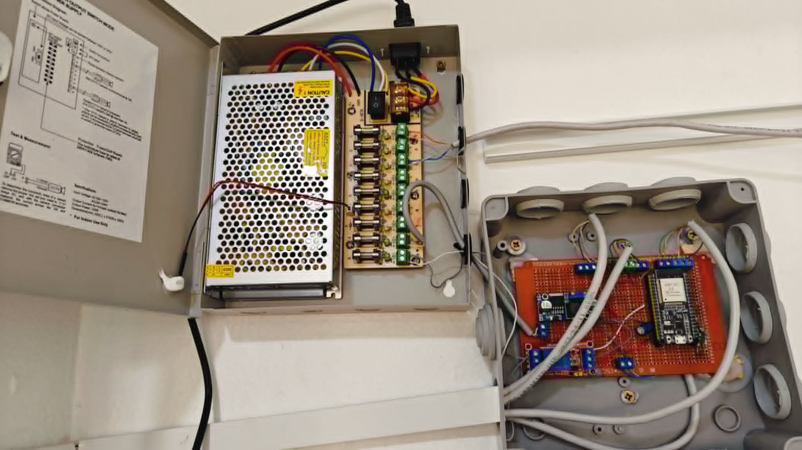

# Smart Classroom Control Node

An ESP32-based IoT edge node for classroom access control, attendance tracking, and classroom automation through a distributed MQTT architecture.

<p align="center">
  
</p>

## Overview

The Smart Classroom Control Node is an embedded system developed as part of a Master's project in Automation and Industrial Computing at Frères Mentouri Constantine 1 University. It is designed to modernize conventional classrooms by combining secure RFID-based access control, automated attendance tracking, occupancy-aware automation, and centralized monitoring.

Each classroom is equipped with an ESP32 controller that interfaces with local sensors and actuators while communicating with a central server over MQTT. The node is responsible for hardware control and event reporting, whereas authorization, attendance management, and long-term data storage are handled by the server. This separation keeps the firmware lightweight, modular, and easier to maintain while allowing multiple classroom nodes to be managed from a single backend.

## Features

- RFID-based classroom access control using dual RDM6300 readers
- RFID attendance tracking with server-side logging
- Occupancy detection using the HLK-LD2410 mmWave radar sensor
- Automatic lighting control based on classroom occupancy
- Projector control through relay outputs
- MQTT communication with a centralized server
- Distributed edge-node architecture with server-side authorization
- Layered firmware architecture for modularity and maintainability
- FreeRTOS-based task scheduling for responsive operation
- Manual override controls for door access and lighting

- ## System Architecture

The Smart Classroom Control Node follows a distributed architecture in which each classroom is equipped with an independent ESP32-based control node. The node is responsible for interacting with local hardware, while a central server manages authorization, attendance records, and system supervision.

```text
                 MQTT over Wi-Fi
+------------------------+        +------------------------------+
|     Central Server     |<------>|  Smart Classroom Control Node|
|------------------------|        |------------------------------|
| • User Authorization   |        | • ESP32-WROOM-32             |
| • Attendance Database  |        | • RFID Readers               |
| • Event Logging        |        | • LD2410 Occupancy Sensor    |
| • Classroom Management |        | • Relay Outputs              |
+------------------------+        | • Local Automation           |
                                  +--------------+---------------+
                                                 |
                       +-------------------------+------------------------+
                       |             |           |                        |
                 Door Lock       Lighting    Projector               Status LEDs
```

The ESP32 acts as a lightweight edge controller. It reads sensors, controls actuators, publishes events through MQTT, and executes classroom automation logic. Decisions requiring centralized data—such as user authorization and attendance management—are handled by the server.

## Hardware Overview

The current prototype is built around an ESP32-WROOM-32 microcontroller and integrates the following hardware components:

| Component | Purpose |
|-----------|---------|
| ESP32-WROOM-32 | Main controller |
| 2× RDM6300 RFID Readers | Access control and attendance tracking |
| HLK-LD2410 mmWave Radar | Classroom occupancy detection |
| 4-Channel Relay Module | Control of lighting, projector, and magnetic door lock |
| 12V Magnetic Lock | Classroom door access control |
| LM2596 Buck Converter | 12V to 5V power regulation |
| Push Buttons | Manual exit and lighting override |
| Status LEDs | Visual system feedback |

## Software Architecture

The firmware follows a layered architecture to separate hardware access, business logic, communication, and system control.

```text
             Application
                  │
            System Layer
                  │
   ┌──────────────┴──────────────┐
   │                             │
Services                 Communication
   │                             │
 Drivers                  Wi-Fi / MQTT
   │
 Hardware Abstraction Layer
   │
          ESP32 Hardware
```

Each layer has a well-defined responsibility, reducing coupling between modules and making the firmware easier to maintain, test, and extend.

## Repository Structure

```text
.
├── docs/                  # Project documentation
├── include/               # Shared headers and configuration
├── src/
│   ├── communication/     # Wi-Fi and MQTT
│   ├── config/            # System configuration
│   ├── drivers/           # Hardware drivers
│   ├── hal/               # Hardware abstraction layer
│   ├── services/          # Business logic
│   ├── system/            # State machine and scheduling
│   └── main.cpp           # Application entry point
├── platformio.ini
└── README.md
```

The project is organized using a layered architecture to separate hardware access, application logic, communication, and system management. This structure simplifies maintenance and allows individual components to evolve independently.

## Project Status

This project was developed as part of a Master's degree in Automation and Industrial Computing and has been validated as a functional prototype.

Implemented features include:

- RFID-based classroom access control
- RFID attendance tracking
- MQTT communication with a centralized server
- Occupancy-aware lighting automation
- Projector control
- Magnetic door lock control
- FreeRTOS-based firmware
- Layered software architecture
- Distributed client-server operation

The repository will continue to receive documentation improvements and code cleanup over time.

## Authors

Developed by:

- **Ahmed Amine Boufas**
- **Mohamed El Mamoune Fedjekhi**

Master's Degree in Automation and Industrial Computing  
Frères Mentouri Constantine 1 University  
Academic Year: 2025–2026

## License

This project is released under the MIT License. See the [LICENSE](LICENSE) file for details.
