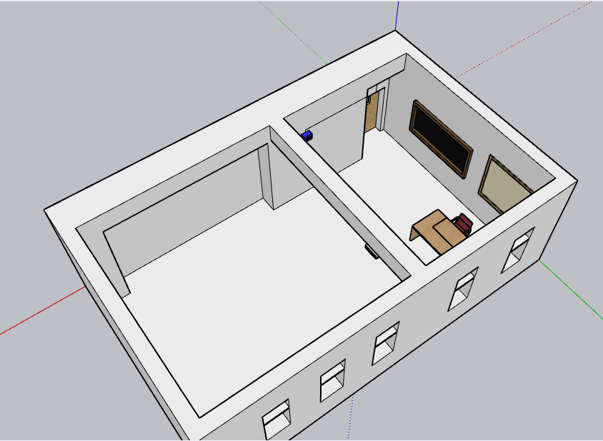
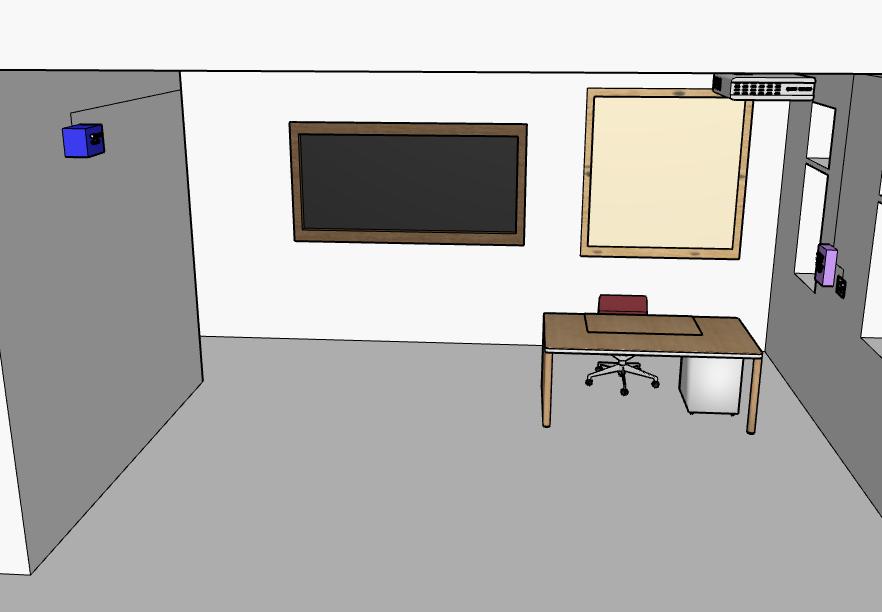
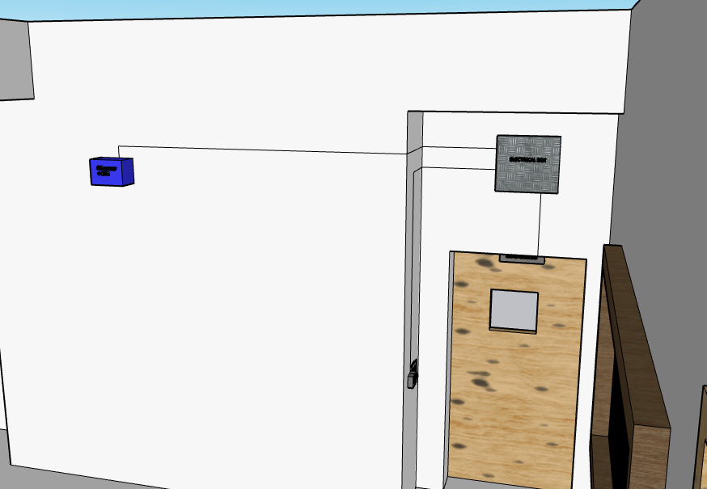
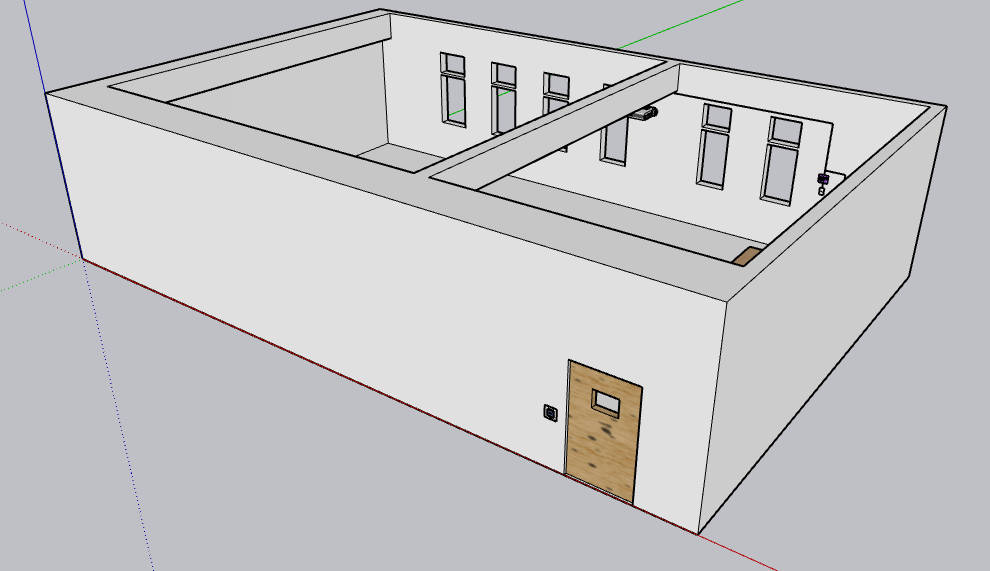
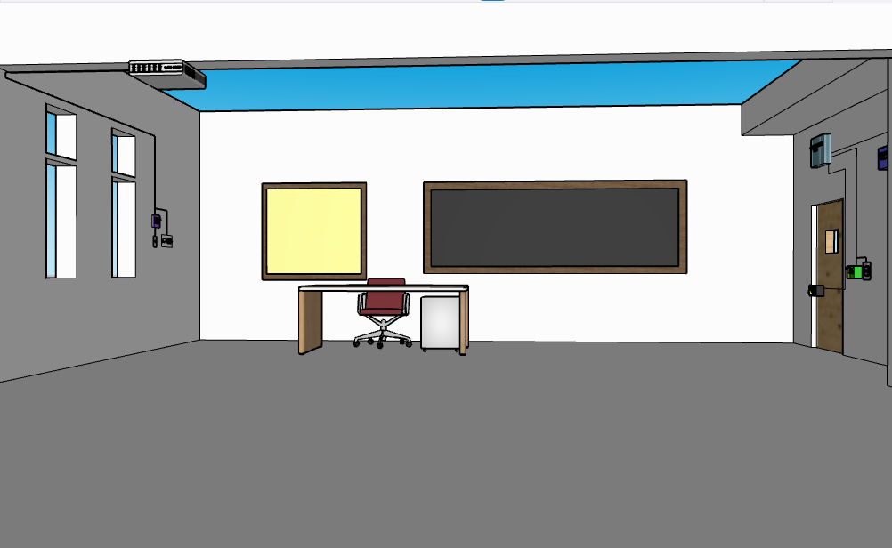
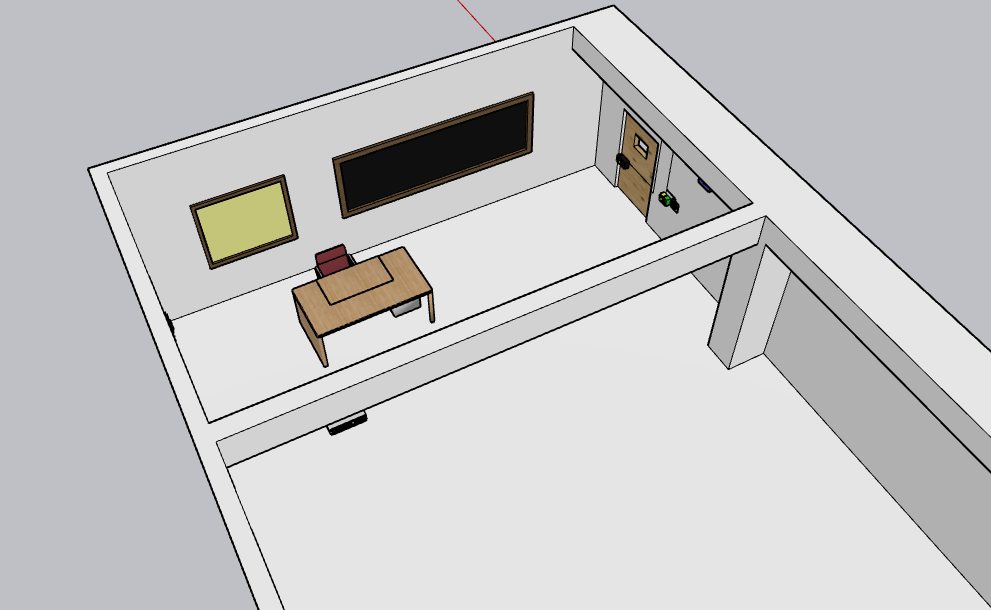
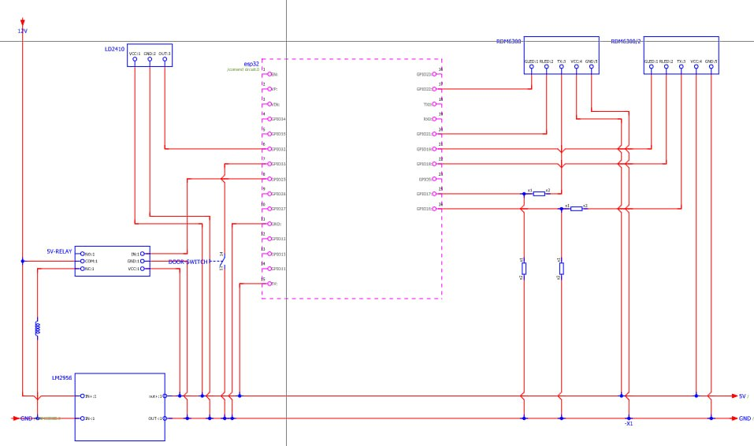

# System Architecture

The Smart Classroom Control Node was designed for deployment in university classrooms, with each room operating as an independent IoT node connected to a centralized server. During the design phase, a complete three-dimensional model of the target classrooms was developed to visualize the proposed installation, evaluate hardware placement, and assist in planning the deployment.

The models do not represent every final implementation detail, as the project evolved throughout development. They instead illustrate the intended system layout and provide context for the engineering decisions that followed.

---

## Classroom Type 1

  

  

*Overview of the initial deployment concept for the first classroom layout.*

The first classroom model was created to determine suitable locations for the access control reader, occupancy sensing hardware, networking equipment, and control electronics. Particular attention was given to cable routing, equipment accessibility, and minimizing the visual impact of the installation.

---

## Classroom Type 2

  

  

*Overview of the deployment concept for the second classroom layout.*

Although both classrooms shared the same functional objectives, differences in their physical layouts required adjustments to equipment placement and installation strategy. Developing separate models made it possible to anticipate these differences before hardware installation began.

---

## Electrical Wiring

  

---
## Design Objectives

The architectural planning phase focused on several practical goals:

- Integrating the system with existing classroom infrastructure.
- Minimizing modifications to the building.
- Selecting practical locations for RFID readers and occupancy sensors.
- Simplifying maintenance and future servicing.
- Maintaining a discreet installation suitable for daily classroom use.

The resulting models served as visual planning tools throughout the project and helped guide the transition from concept to physical implementation.
