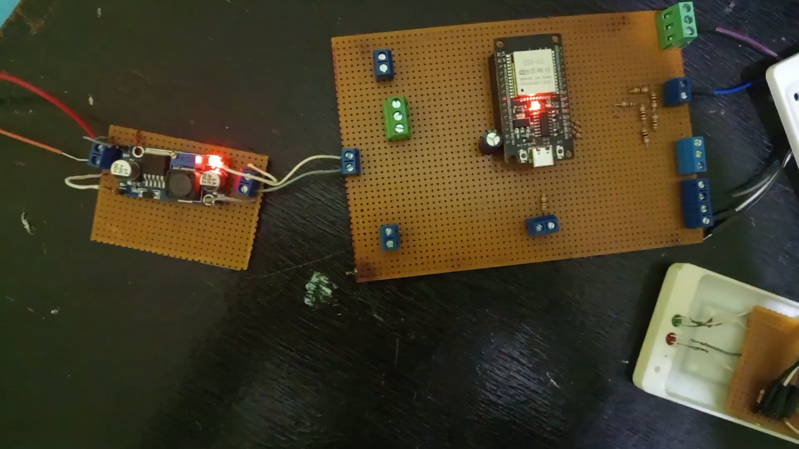
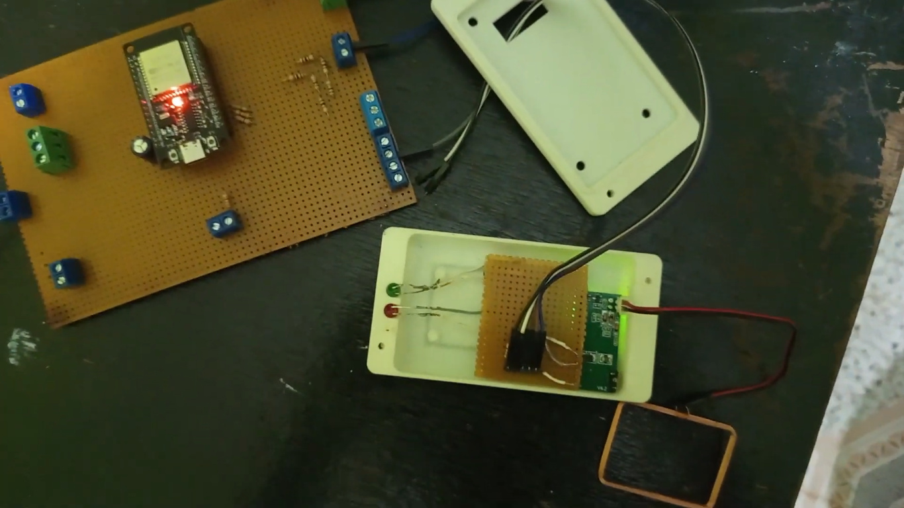
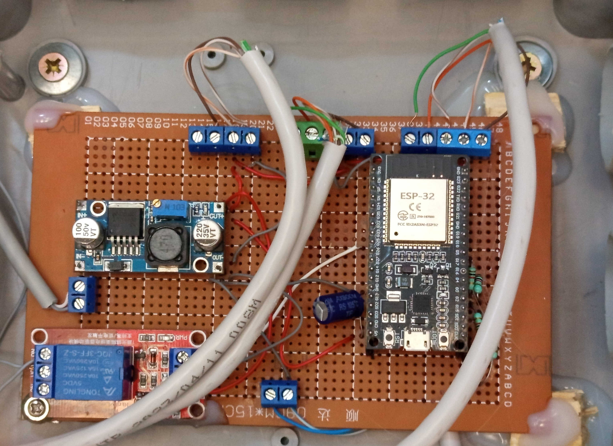
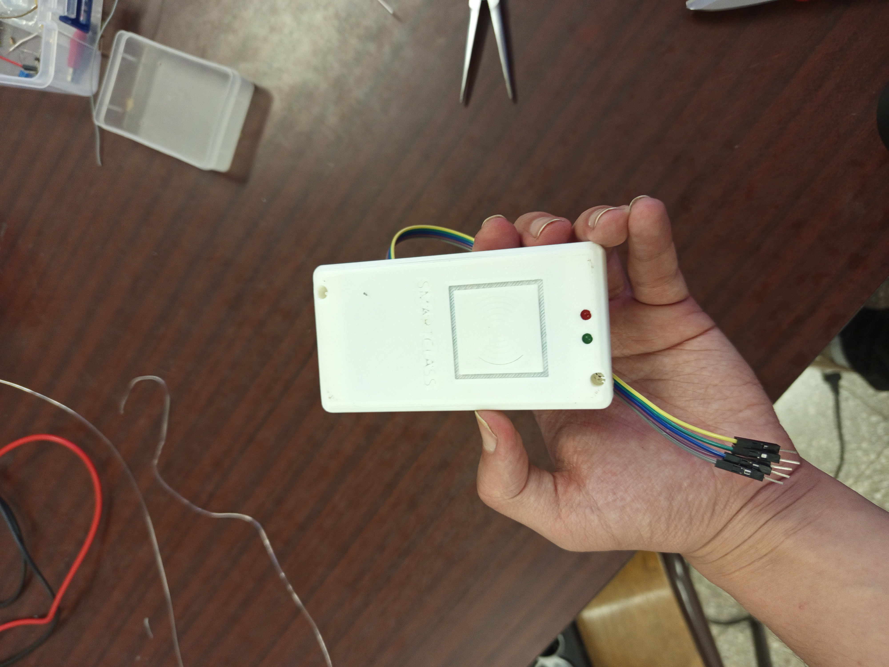
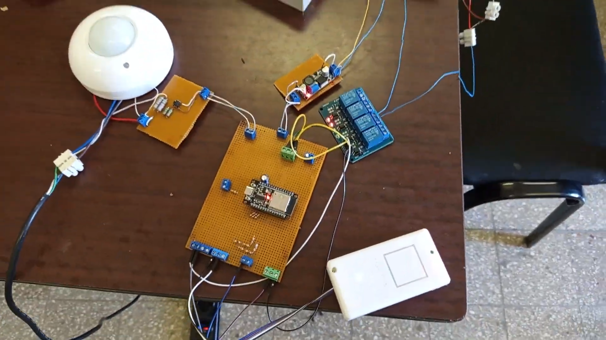
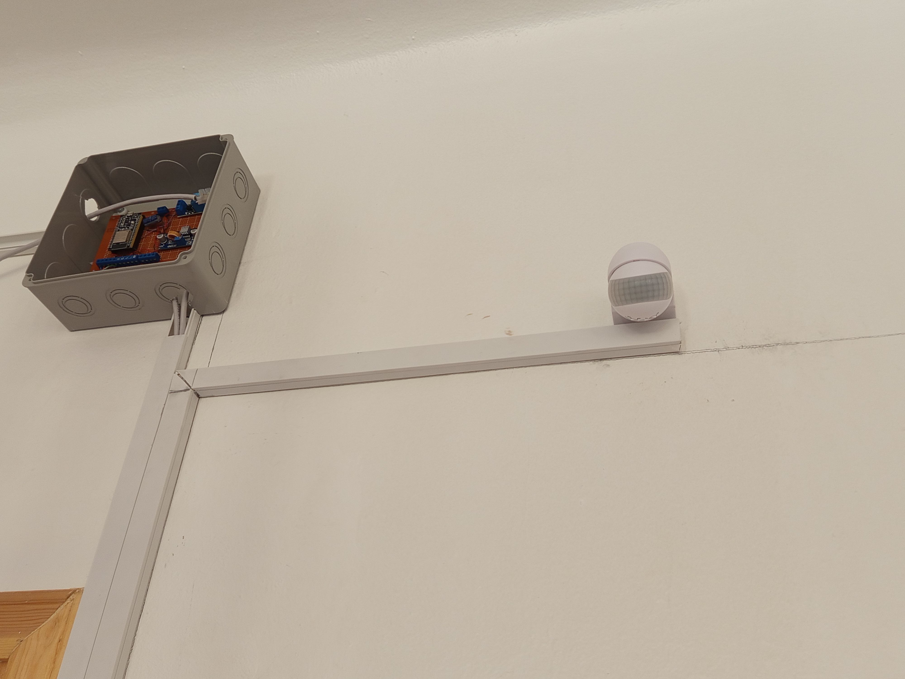

# Development Process

The Smart Classroom Control Node was developed through several iterations, with both the hardware and firmware evolving as new requirements emerged and practical challenges were encountered. Rather than following a fixed design from the beginning, the project gradually matured through prototyping, testing, and refinement.

This document highlights some of the major stages of the development process and illustrates how the final prototype evolved from its initial concepts.

---

## Early Hardware Prototyping

Initial development focused on validating the core hardware components and establishing reliable communication between the ESP32, RFID readers, relay module, and supporting peripherals. Breadboards, perfboards, and temporary wiring arrangements were used extensively before assembling the final prototype.

---

## Circuit Assembly

*Assembly of the prototype control circuitry.*

As the design matured, the prototype was transferred to a more permanent assembly. Custom wiring, soldered connections, and modular components allowed individual subsystems to be tested independently before being integrated into the complete system.

---

## 3D Printed Enclosures

*Custom enclosure produced using 3D printing.*

To improve installation and protect the electronics, custom enclosures were designed and manufactured using 3D printing. These housings were adapted to accommodate the RFID readers and control electronics while providing a cleaner and more practical installation.

---

## Installation Preparation

*Preparing the system prior to classroom installation.*

Before deployment, each subsystem was verified individually to reduce integration issues during installation. This included functional testing of the hardware, power distribution, communication interfaces, and relay-controlled devices.

---

## Classroom Installation

*Installation of the prototype within the classroom environment.*

The final installation required integrating the system into an existing classroom while minimizing modifications to the surrounding infrastructure. Wiring, mounting, and electrical integration were carried out incrementally, allowing each subsystem to be validated before the complete system entered operation.

---

## Engineering Challenges

Throughout development, several practical engineering challenges influenced the evolution of the system, including:

- Electrical noise generated by relay switching and magnetic door locks.
- Hardware integration within limited installation space.
- Power distribution and voltage regulation.
- Reliable communication between distributed hardware modules.
- Mechanical adaptation of enclosures for classroom deployment.
- Incremental firmware refinement as new hardware revisions were introduced.

Addressing these challenges resulted in a more reliable prototype and provided valuable practical experience beyond the initial system design.
