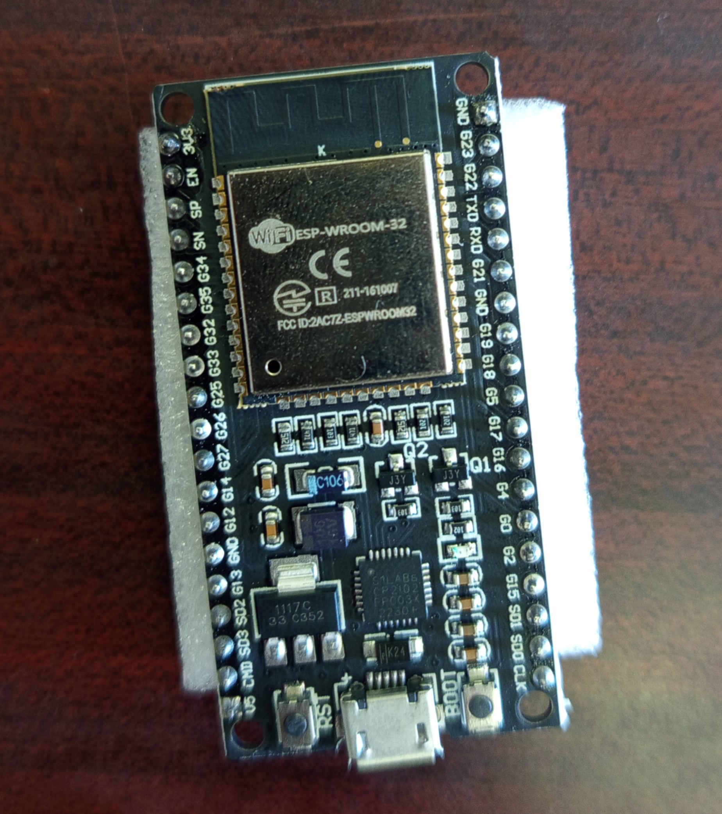
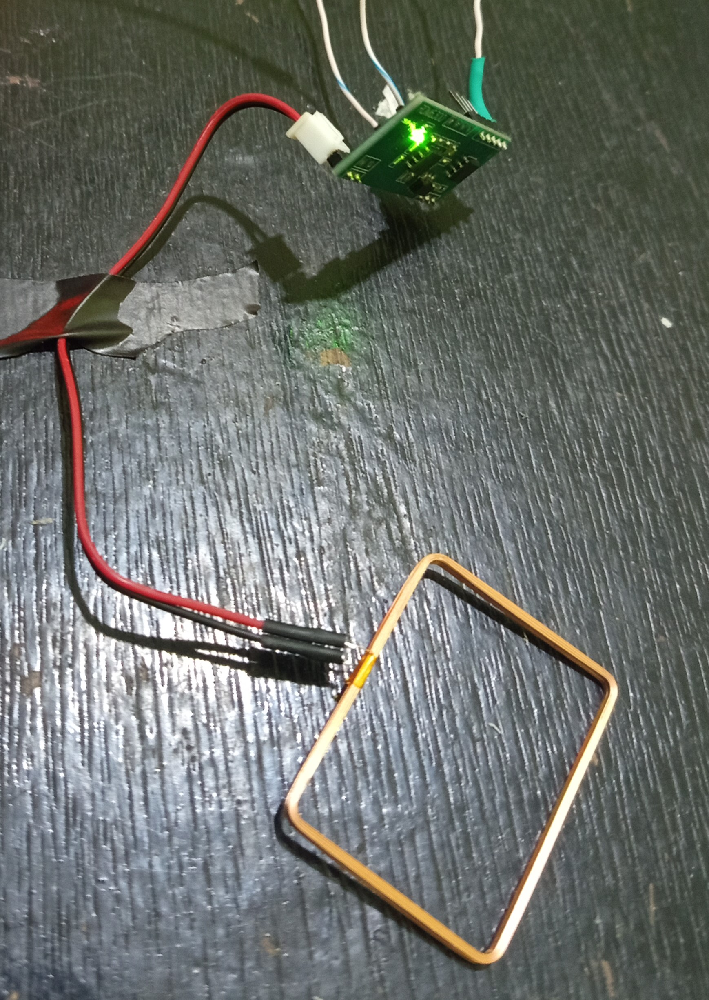
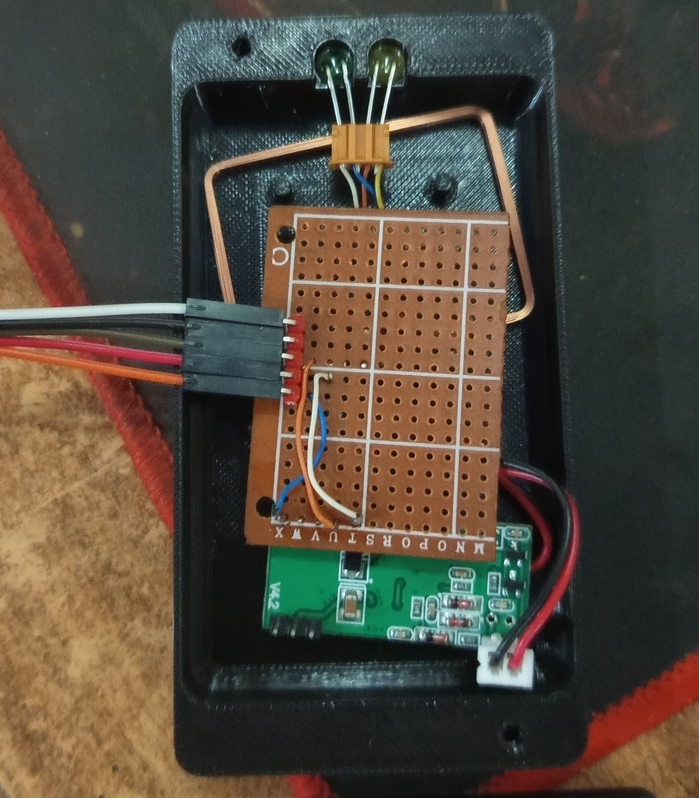
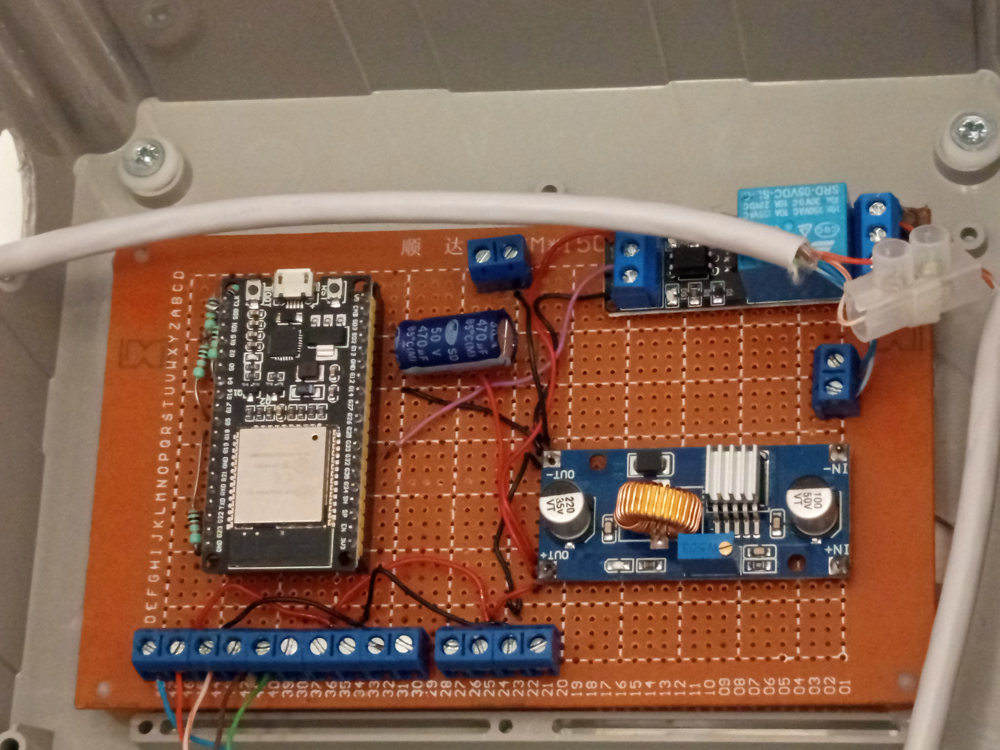
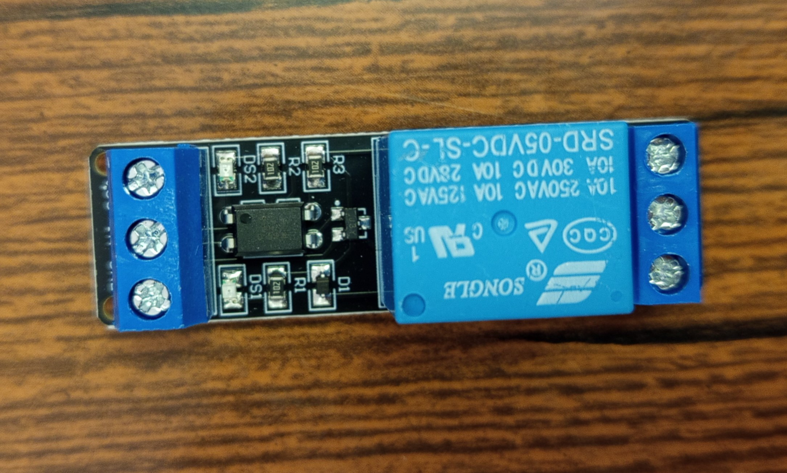
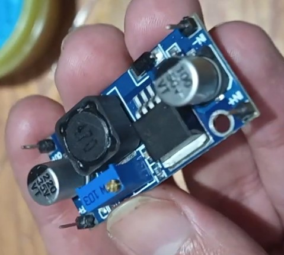
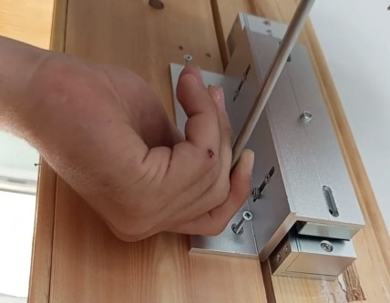
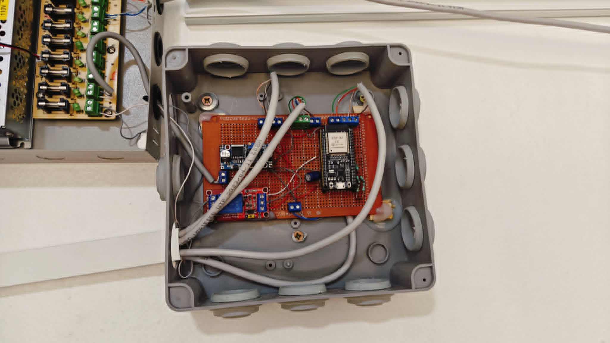

# Hardware Overview

The Smart Classroom Control Node integrates commercially available embedded hardware with custom-built assemblies to provide classroom access control, attendance tracking, and local automation. This page presents the primary hardware components that make up the prototype and illustrates how they were integrated into the final system.

---

## ESP32 Control Unit

*ESP32-WROOM-32 development board used as the main controller.*

The ESP32 serves as the central processing unit of the Smart Classroom Control Node. It coordinates communication with peripheral devices, executes the system firmware, communicates with the MQTT server over Wi-Fi, and controls the connected hardware through its GPIO interfaces.

---

## RFID Subsystem

*RDM6300 RFID reader integrated into its custom enclosure.*

RFID technology forms the basis of both classroom access control and attendance tracking. The prototype uses dedicated RFID readers enclosed in custom 3D-printed housings designed specifically for classroom installation.

*Internal electronics of the RFID reader assembly.*

The enclosure was designed to protect the electronics while allowing straightforward installation and maintenance.

---

## Control Electronics

*Prototype control electronics.*

The control circuitry integrates the ESP32, relay module, power regulation hardware, and supporting connections into a single prototype assembly. During development, several hardware revisions were produced before reaching the final configuration.

---

## Relay Module

*Relay module used to interface the controller with external electrical loads.*

The relay module provides electrical isolation between the ESP32 and higher-power classroom equipment, including lighting circuits, projector control, and the magnetic door lock.

---

## Power Regulation

*LM2596 buck converter used for voltage regulation.*

A dedicated DC-DC buck converter supplies the regulated 5 V rail required by the embedded electronics while allowing the system to operate from the classroom's primary power source.

---

## Magnetic Door Lock

*Electromagnetic lock installed on the classroom entrance.*

Access to the classroom is controlled using a magnetic door lock that is actuated following authorization by the centralized server.

---

## Prototype Assembly

*Completed Smart Classroom Control Node prototype.*

The completed prototype combines the processing hardware, communication interfaces, power regulation, and control circuitry into a single integrated system suitable for deployment within the classroom environment.
